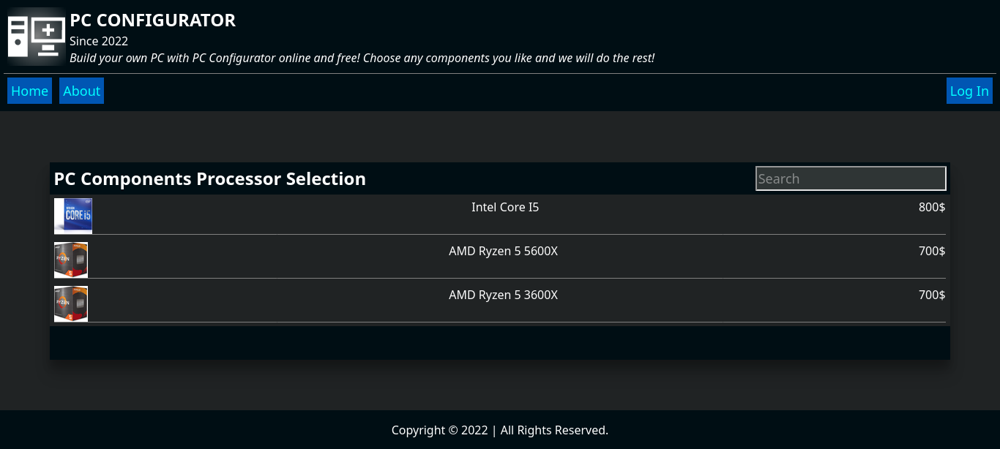
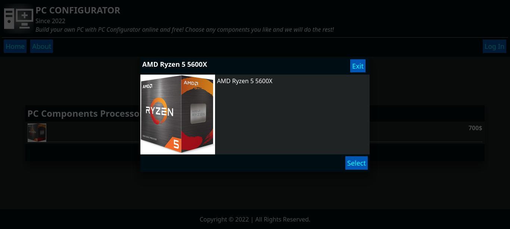
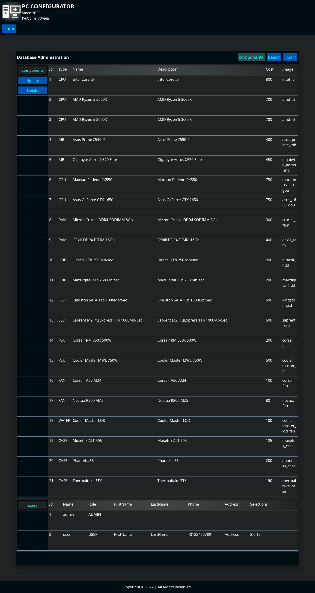

# Computer components web-application

This is a web-application written in Java at the back-end and in pure
HTML, CSS, JavaScript at the front-end. Application is server-based, 
and it uses Spring framework as core.

## Features

- PC configurator
- Catalogue browser
- Configuration saver and price totalizer
- Database administration
- Logging in, out and registration
- CSRF attacks resistance

## Screenshots









## Build
Execute the following command to build & generate the jar file:
```sh
gradlew bootjar
```

## Installation

This application requires Docker and docker-compose to run.
App uses port 8080 and 5432.

Download the [jar file](https://github.com/vadniks/ComputerComponentsWebApp/blob/master/cursov_templates-0.0.1-SNAPSHOT.jar), [Dockerfile](https://github.com/vadniks/ComputerComponentsWebApp/blob/master/Dockerfile) and [docker-compose file](https://github.com/vadniks/ComputerComponentsWebApp/blob/master/docker-compose.yml).

In the project root or in the directory in which 
you have placed the above-mentioned files execute 
the following command to run the application:
```sh
docker-compose build && docker-compose run
```
after these procedures the application will be available at:
```
http://localhost:8080
```
in any browser.
To stop the app just send the interruption signal by 
holding Ctrl and pressing C, execute this command to
remove its containers:
```sh
docker-compose down
```
